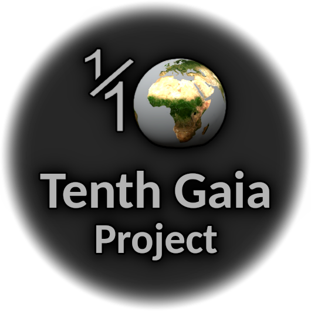
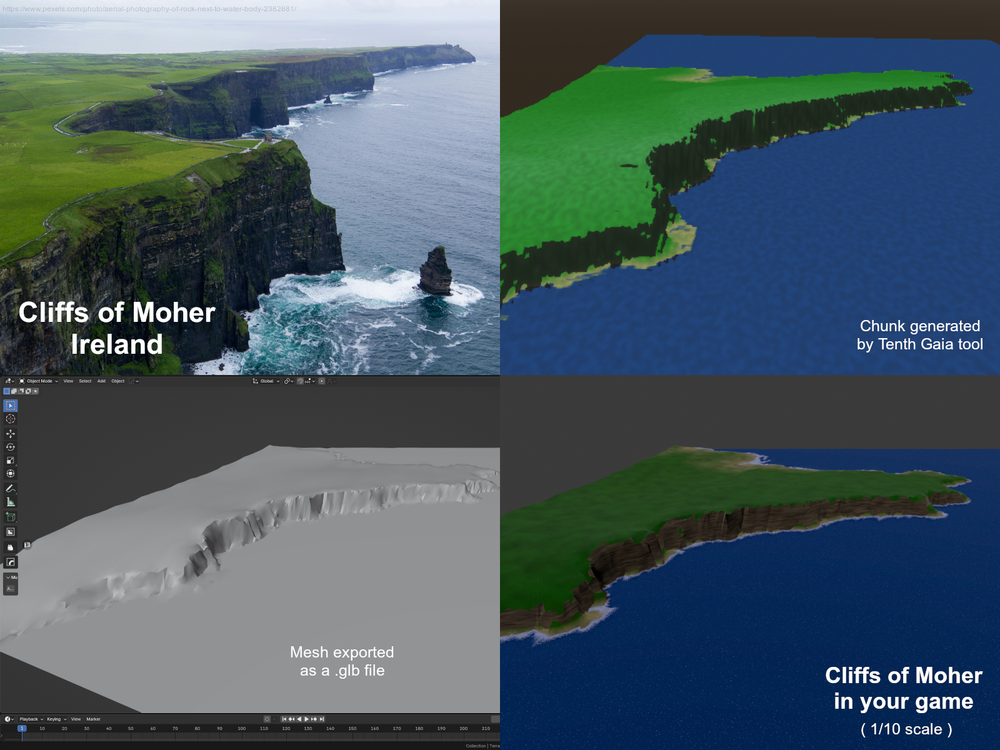
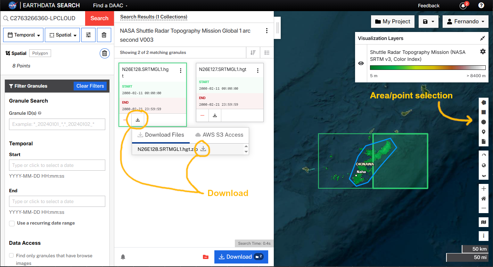
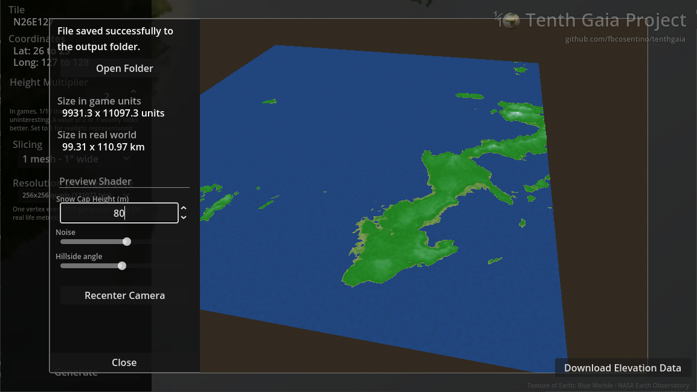
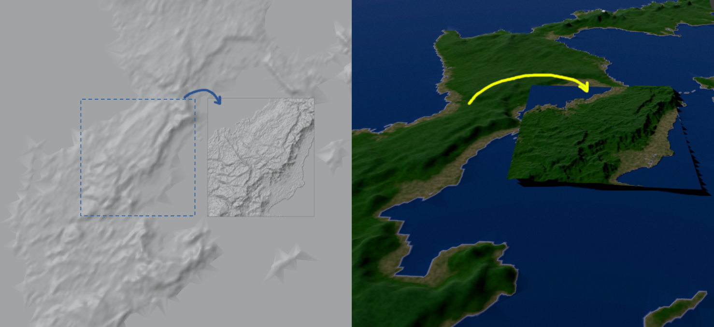

Planet Earth, 1/10 the size.

----

Games and other 3D applications often use or take place in our real world (from historical settings in games to flight simulators). However, planet Earth is way too large causing issues with performance and player travel times. A common solution is to use a miniature version, and the Tenth Gaia project exists to support developers with a 1/10 size version of our real world, made with data from NASA's Shuttle Radar Topography Mission.

This project consists of both a tool to generate terrains in a variety of possible sizes and resolutions, and a set of pre-generated 3D meshes in .glb format ready for use in any 3D game engine. (The tool is already available from day one, and the pre-generated meshes will be added to the repository over time.)

(The name "Tenth Gaia" is a homage to the TV show _Log Horizon_, in which the game uses a project called "Half Gaia" which is Earth at half size.)

If you use Tenth Gaia in your project, please credit with "Uses the Tenth Gaia Project" or similar, or including the image below somewhere (can be in your site, credits, documentation... doesn't have to be in-game).

## Chunk sizes

NASA's SRTM provides data in tiles of 1° lat x 1° long, so this is the maximum size for a generated terrain - but it can be split in smaller slices. Tiles can be generated whole, in 16 slices (4x4 grid) 15' wide each, or in 100 slices (10x10 grid) of 6' each.

The full 1°x1° tiles are 111 km (68.7 miles) end-to-end in latitude in real world (corresponding to 11k units in game).

For size comparison:
* Porto Rico _almost_ fits inside a tile (it would fit if it wasn't an elongated shape)
* South Korea occupies 22 tiles
* Luxembourg touches 4 tiles
* Mexico occupies 251 tiles
* Brazil occupies 798 tiles 
* Ireland touches 24 tiles
* Okinawa's size would easily fit into a tile (it's between two tiles so you need to generate both)

When slicing in a 4x4 grid, each chunk will be around 28 km (17 miles) in real world (2.8k units in game), and when slicing in a 10x10 grid each chunk is 11.1 km (6.9 miles) in real world (1.1k units in game). The chunk in the Cliffs of Moher example above is a 10x10 slice.

Only parts of the world between latitudes -60 and +60 are available. You can check the available tiles and their sizes [here](https://dwtkns.com/srtm30m/).

## Mesh Resolution

Four resolutions are available:
* 64 x 64 quads (total of 8192 tris per chunk)
* 128 x 128 quads (total of 32768 tris per chunk)
* 256 x 256 quads (total of 131072 tris per chunk)
* 512 x 512 quads (total of 524288 tris per chunk)

This resolution is per chunk, regardless of chunk size in real world, which means slicing tiles increases per-metre/per-game unit resolution. The Cliffs of Moher example above uses 256x256 resolution.

It's **strongly recommended** to load the exported file in blender and apply a decimate modifier before using in your game or application. In the Cliffs of Moher example above, `Decimate` was applied as `Collapse` with a `0.1` factor, bringing it down to around 60k tris. Depending on the terrain shape, decimating as `Un-Subdivide` might also work well (enter `Edit` mode, select everything, right-click and select `Triangles to Quads` before using the modifier).

## Per Metre Resolution

Chunk sizes and mesh resolutions can be combined to generate the same place and surrounding areas in different levels of detail (LOD). As example, you can use full tiles in 64x64 for distant landscape, while using a 10x10 slice generated at 256x256 (before decimation) for the terrain under the player's feet.

As you change the options, the tool will tell you in the interface the resolution in metres since this value changes depending on latitude (it will tell you the WE axis).

The worst and best cases are:

* Full tile in 64x64 mesh on the equator (lat 0): one vertex every 174 game units, corresponding to 1.7km in real world, regardless of axis
* Slice of 10x10 in 512x512 mesh on lat 59: on WE axis, one vertex every 1.1 game units, corresponding to 11 metres in real world (2.2 game units and 22 metres for SN axis)

## How to Use

The repository doesn't include NASA's SRTM database, so you download it separately for the tiles you want.

First, make sure you have an account at [EarthData](https://urs.earthdata.nasa.gov/). Then use [EarthData's interactive search tool](https://search.earthdata.nasa.gov/search/granules?p=C2763266360-LPCLOUD&pg[0][v]=f&pg[0][gsk]=-start_date&q=C2763266360-LPCLOUD) to download the tiles.

In the search tool, use the tools on the right (square, poligon, point, etc) to select your point/area of interest, and the relevant tiles will show in green, with a list on the left side. You're looking for files with `.hgt.zip` extension, with a name starting with the coordinates (e.g. `N12E034`), which will show up in boxes on the left panel with a button to download them.

Place the downloaded `.hgt.zip` files inside a folder named `maps` inside Tenth Gaia's directory, and start the tool (if it's already running, restart). The tiles will show up to be selected.

Example - the two tiles encompassing Okinawa:

Then select the desired chunk size and mesh resolution, and hit `generate`. The result will be saved as a `.glb` file inside the `output` folder (where TenthGaia is running) and presented for your inspection.

If you're slicing the tile, all chunks will be generated in sequence, saved, and the last one will be presented. You can also manually enable/disable chunks you don't want generated, by clicking on the boxes to disable them.

During inspection (the file is already written), you can experiment with a preview shader with a few options:

* Snow cap: the shader uses colours for heights. This option adjusts the height in metres (in-game, not real world) for the top of the scale (white)
* Noise: adds random noise as texture to the terrain, to facilitate visualising hills and distances
* Hillside: allows a different darker colour when the face is too steep (the Cliffs of Moher example on the top of the page uses this)

Use mouse scroll to control zoom, left click to rotate the camera, and middle or right click to pan.

In the example below, the tile N26E127 was generated full in lower resolution for a lower (distant) LOD, and its 10x10 chunk number `7,7` generated in 256x256 resolution for the area surrounding the player.

----

# Licensing

The Tenth Gaia tool itself is MIT license, and pre-generated meshes for terrains available from this repository are CC0. Credit is not legally required, but if you use this project (tool or meshes) you're encouraged to credit with a simple "uses the Tenth Gaia Project" or the image:

The underlying data from NASA is in public domain, so you are free to do whatever with any games you make using terrains generated with Tenth Gaia.

* Earth texture for the globe: _Blue Marble - NASA Earth Observatory._
* Data source: _NASA JPL. (2013). NASA Shuttle Radar Topography Mission United States 1 arc second [Data set]. NASA Land Processes Distributed Active Archive Center._
